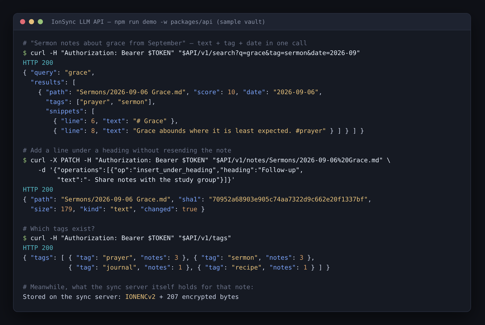

# IonSync

Self-hosted, end-to-end vault synchronization for [Obsidian](https://obsidian.md). You run the server; the plugin keeps every device in sync over WebSocket.

---

## How it works

```
┌─────────────┐   WebSocket (ws:// or wss://)   ┌──────────────┐
│  Obsidian   │ ◄──────────────────────────────► │  IonSync     │
│  Plugin     │                                  │  Server      │
└─────────────┘                                  └──────────────┘
     Device A                                         │
                                                      │ broadcasts
┌─────────────┐                                       │
│  Obsidian   │ ◄─────────────────────────────────────┘
│  Plugin     │
└─────────────┘
     Device B
```

- **Last-write-wins** conflict resolution by client-reported mtime
- **Versioned storage** — server keeps N historical versions per file (configurable)
- **Auto-update** — server distributes new plugin builds to clients on connect
- **Web dashboard** — monitor peers, devices, stored files, and server logs at `/dashboard`
- **LLM API** (optional) — let an AI assistant search, read, write and edit your notes over a token-protected REST API, without the server ever seeing plaintext. See [LLM API](#llm-api)

---

## Quick start with Docker

```bash
# 1. Create an env file
echo "IONSYNC_PASSWORD=your-secret-password" > .env

# 2. Start the server
docker compose up -d

# 3. Open the dashboard
open http://localhost:3000/dashboard
```

The server listens on port `3000` by default. Data (SQLite database + file versions) is stored in a Docker named volume so it survives container restarts. Automatic SQLite backups are written to `<dataDir>/backups/` (a `pre-migrate` snapshot on every startup, plus periodic `daily` snapshots via `VACUUM INTO`); tune them with the `backup` config block or the `BACKUP_INTERVAL_HOURS` / `BACKUP_RETAIN` env vars.

---

## Docker configuration

### Environment variables

Set these in your `.env` file or directly in `docker-compose.yml`:

| Variable | Default | Description |
|---|---|---|
| `IONSYNC_PASSWORD` | **required** | Shared password — used by the plugin and the dashboard |
| `IONSYNC_PORT` | `3000` | Host port (maps to container port 3000) |
| `IONSYNC_LOG_LEVEL` | `3` | `0` silent · `1` errors · `2` warnings · `3` info |
| `IONSYNC_VERSIONS_PER_FILE` | `5` | Maximum stored versions per file path |
| `IONSYNC_CLEANUP_INTERVAL` | `3600` | Cleanup job interval in seconds |
| `IONSYNC_KEEP_DELETED_SECS` | `604800` | Seconds to retain deleted file records (default 7 days) |

### Custom config file

For advanced options (TLS, custom paths), mount a config file instead:

```yaml
# docker-compose.yml
volumes:
  - ./config.js:/app/config.js:ro
```

```js
// config.js
export default {
  password: "your-secret-password",
  port: 3000,
  host: "0.0.0.0",
  appDir: "/app",   // do not change when using Docker
  dataDir: "/data", // do not change when using Docker
  cleanup: {
    intervalSecs: 3600,
    versionsPerFile: 5,
    keepDeletedFilesSecs: 7 * 24 * 3600,
  },
  logs: { level: 3 },
};
```

### TLS / HTTPS

```js
// config.js
export default {
  password: "...",
  tls: {
    key:  "/certs/privkey.pem",
    cert: "/certs/fullchain.pem",
  },
  appDir: "/app",
  dataDir: "/data",
};
```

```yaml
# docker-compose.yml
volumes:
  - ./config.js:/app/config.js:ro
  - ./certs:/certs:ro
ports:
  - "3000:3000"
```

The server will use `wss://` when TLS is configured. Update the plugin connection URL accordingly.

The `tls` block above secures the **public sync** server. The **admin dashboard**
runs on a separate port and is plain HTTP by default (fine when it's bound to
loopback/LAN). To protect its session cookie in transit, serve it over HTTPS one
of two ways — either marks the cookie `Secure`:

```js
// config.js — (a) native TLS for the dashboard (self-signed is fine on a LAN)
adminTls: { key: "/certs/dash-key.pem", cert: "/certs/dash-cert.pem" },

// …or (b) behind a TLS-terminating reverse proxy (Caddy/nginx/Traefik):
trustProxy: true,   // trusts X-Forwarded-Proto — enable ONLY behind such a proxy
```

`trustProxy` can also be set with the `TRUST_PROXY=1` environment variable.

---

## Manual setup (without Docker)

### Prerequisites

- Node.js 18+
- npm 9+

### Install

```bash
git clone <repo>
cd v2
npm install
```

### Build the server

```bash
# Compile shared types
npm run build -w packages/protocol

# Compile the server
npm run build -w packages/server
```

### Configure

```bash
cd packages/server
cp config.example.js config.js
# Edit config.js — set password and any other fields
```

### Run

```bash
# Production (compiled)
cd packages/server
npm start

# Development (live reload via tsx)
npm run dev
```

---

## Plugin installation

The plugin is not yet published to the Obsidian Community Plugin directory. Install it manually:

1. **Build the plugin** (requires the server to already be set up):
   ```bash
   cd packages/plugin
   npm run build
   # Outputs: packages/server/client/main.js, styles.css, manifest.json
   ```

2. **Copy to your vault:**
   ```
   <vault>/.obsidian/plugins/ion-sync/main.js
   <vault>/.obsidian/plugins/ion-sync/styles.css
   <vault>/.obsidian/plugins/ion-sync/manifest.json
   ```
   Or set `OBSIDIAN_PLUGIN_DIR` before building and it copies automatically.

3. **Enable the plugin** in Obsidian → Settings → Community plugins.

4. **Configure** in Settings → IonSync:
   - Server URL: `ws://your-server:3000` (or `wss://` with TLS)
   - Password: same as `IONSYNC_PASSWORD`

### Auto-update

Once connected, the server compares the plugin's `version` and `build` against the files in `packages/server/client/`. If they differ, the server pushes new plugin files to the client and the plugin hot-reloads itself. This means you only need to manually install once — future updates propagate automatically when you rebuild and redeploy.

**Signed updates.** Because the plugin hot-reloads server-pushed code, update bundles are **ed25519-signed** so a rogue or man-in-the-middle server cannot push arbitrary code (this works over `ws://` and `wss://` alike — no TLS required). Provide the private key to the image build as the `IONSYNC_SIGN_KEY` build argument (raw 32-byte ed25519 key, hex):

```
docker build --build-arg IONSYNC_SIGN_KEY=<hex-private-key> -t ionsync .
```

In Dockhand, set `IONSYNC_SIGN_KEY` as a **build** environment variable on the stack. The plugin pins the matching **public** key in `packages/plugin/src/updateKey.ts` (to rotate, change both). If no key is provided the build is unsigned and clients that pin a key will **refuse** to auto-update — a safe, loud failure, never remote code execution. The private key never enters the runtime image.

---

## Dashboard

Visit `http[s]://your-server:3000/dashboard` to access the web dashboard.

| Tab | What it shows |
|---|---|
| **Overview** | At-a-glance stats: active peers, known devices, file count, pending uploads |
| **Peers** | Currently connected WebSocket clients — trigger sync or disconnect individually |
| **Devices** | All devices that have ever connected, with last-seen timestamp |
| **Files** | Browse and delete stored file versions (searchable by path) |
| **Logs** | Live-tailing server log ring buffer |

The dashboard auto-refreshes every 5 seconds. Authentication uses the same password as the plugin, stored as a 7-day HttpOnly cookie.

---

## LLM API

An optional REST API that lets an AI assistant (or any script) work with your vault: **search, list, read, create, edit, move and delete notes**. Changes reach every synced device within seconds and are kept in version history like any other edit.



*Real output from `npm run demo -w packages/api`, which runs the API against a throwaway server and a sample vault.*

```
┌────────────┐  HTTPS + bearer token  ┌──────────────┐  WebSocket (as a device)  ┌──────────────┐
│ LLM / tool │ ─────────────────────► │ ionsync-api  │ ◄───────────────────────► │ IonSync      │
└────────────┘                        │ decrypts in  │      ciphertext only      │ Server       │
                                      │ memory       │                           └──────────────┘
                                      └──────────────┘
```

It runs as a second container (`ionsync-api`, same image) that logs in to the server as an ordinary sync device named "LLM API":

- **End-to-end encryption stays intact.** The vault password lives only in the API container; the sync server still stores ciphertext, and plaintext is never written to disk.
- **No silent overwrites.** Writes go through the same conflict handling as the plugin. A write that races another device returns `409` and the losing text is kept as a reviewable conflict.
- **Search with filters.** Full-text search plus tag, frontmatter and date scoping: `q=sermon&date=2026-09`, `tag=prayer`, `frontmatter=type:sermon`.
- **Built for models.** An OpenAPI 3.1 spec at `/v1/openapi.json` with descriptions written for an LLM, targeted edits (`append`, `replace`, `insert_under_heading`), a folder overview, and outline or line-window reads for long notes.
- **Fenced.** `.obsidian/` and other dot-folders are invisible, deletes are rate-capped, and an optional second token is read-only.

### Enable it

The API is off until it has a token.

```bash
# .env
IONSYNC_API_TOKEN=$(openssl rand -hex 32)     # full access: read, write, edit, move, delete
IONSYNC_E2EE_PASSWORD=your-vault-encryption-password   # only if E2EE is on in the plugin
# IONSYNC_API_READ_TOKEN=...                  # optional: a token that can only read and search
# IONSYNC_API_PORT=3002                       # host port
# IONSYNC_API_TZ=America/Los_Angeles          # time zone for date filters
# IONSYNC_API_TRUST_PROXY=1                   # when behind a reverse proxy / tunnel
```

```bash
docker compose up -d
curl http://localhost:3002/v1/health          # {"ok":true,"connected":true,"synced":true}
```

Then point your assistant at `http://<host>:3002/v1/openapi.json` and give it the token as a Bearer token. To reach it from outside your network, put it behind HTTPS (a reverse proxy or tunnel) — never expose the port over plain HTTP.

Full reference — every endpoint, filter, edit operation and limit: **[packages/api/README.md](packages/api/README.md)**.

---

## Project structure

```
v2/
├── packages/
│   ├── protocol/   # Shared TypeScript message types (wire protocol)
│   ├── server/     # Node.js WebSocket + HTTP server
│   ├── plugin/     # Obsidian plugin (esbuild bundle)
│   └── api/        # Optional LLM REST API (headless sync client)
├── Dockerfile
├── docker-compose.yml
└── CLAUDE.md       # Developer reference
```

See [`CLAUDE.md`](CLAUDE.md) for the full architecture, protocol reference, and developer guide.

---

## License

MIT
